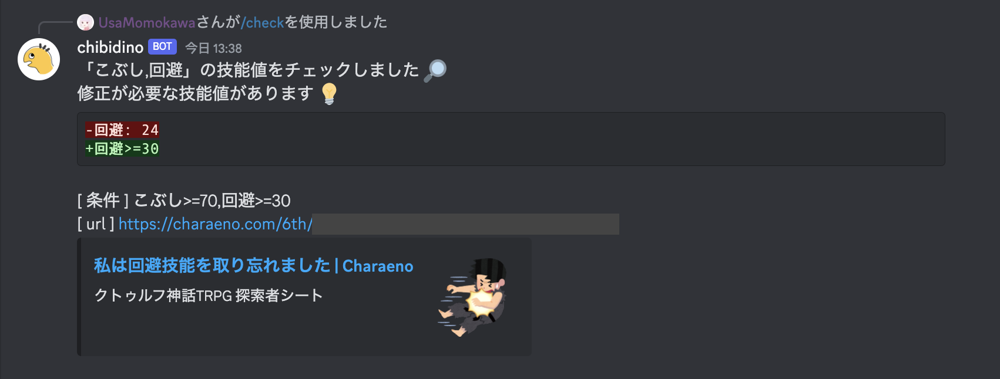

# charadino

Charaeno + Discord bot + Deno

[Charaeno](https://charaeno.com/) のキャラクターシートの技能値をチェックする
Discord bot です。

## 使い方

1. Discord サーバーに bot を導入する
2. `/check`コマンドを実行する
   - 条件:
     技能値の条件を不等号で指定します。カンマ区切りで複数条件を指定できます。
   - URL: Charaeno のキャラクターシートを指定します。
   - `/check こぶし>=70,回避>=30 https://charaeno.com/6th/{id}`



## 開発

- Discord botを作成する
  - SCOPES: `bot`, `applications.commands`
  - BOT PERMISSIONS: `Send Messages`

```shell
$ cp .env.example .env # .env に Discord bot token を設定する
$ deno task dev
```

## 仕組み

Deno で実装しています。

Discord のスラッシュコマンドをトリガに、Charaeno
APIを叩いてキャラクターシートの情報を取得します。条件をもとに技能値を検査して、結果を返します。

## モチベーション

クトゥルフ神話TRPGを遊ぶときに、意図せずキャラクターの技能値を振り忘れてしまうことがありました。キャラクターシートを隅々まで確認するのは大変なので、キャラクターの技能値の振り忘れをなくす仕組みを作りたいと考えました。
